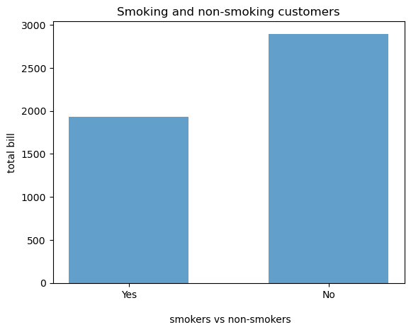
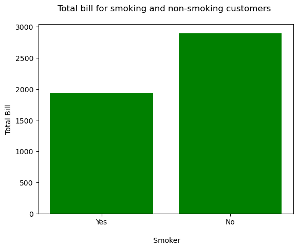

<div align="center" style=" font-size: 80%; text-align: center; margin: 0 auto">

</div>

# Exercise: Introduction to data visualisation

© ExploreAI Academy

In this exercise, we will reinforce our knowledge of the fundamental concepts of data visualisation by applying Matplotlib, and data preparation and analysis techniques, to a real-world scenario.

## Learning objectives
By the end of this exercise, you should be able to:

* Group, sort, and sum data to plot an insightful visual.

### Import packages and data


```python
# Import libraries 
import matplotlib.pyplot as plt #used for plotting data 
import numpy as np #used for mathematical operations
import pandas as pd #used to load CSV data
```

For this exercise, we will be using [the tips](https://www.kaggle.com/jsphyg/tipping) dataset, which consists of customer tip data collected over a period of two and half months in early 1990 from one restaurant by a food server.

Let's go ahead and import our data.


```python
df = pd.read_csv("https://raw.githubusercontent.com/Explore-AI/Public-Data/master/Data/tips.csv")
df.head()
```


<div>
<style scoped>
    .dataframe tbody tr th:only-of-type {
        vertical-align: middle;
    }

    .dataframe tbody tr th {
        vertical-align: top;
    }

    .dataframe thead th {
        text-align: right;
    }
</style>
<table border="1" class="dataframe">
  <thead>
    <tr style="text-align: right;">
      <th></th>
      <th>total_bill</th>
      <th>tip</th>
      <th>sex</th>
      <th>smoker</th>
      <th>day</th>
      <th>time</th>
      <th>size</th>
    </tr>
  </thead>
  <tbody>
    <tr>
      <th>0</th>
      <td>16.99</td>
      <td>1.01</td>
      <td>Female</td>
      <td>No</td>
      <td>Sun</td>
      <td>Dinner</td>
      <td>2</td>
    </tr>
    <tr>
      <th>1</th>
      <td>10.34</td>
      <td>1.66</td>
      <td>Male</td>
      <td>No</td>
      <td>Sun</td>
      <td>Dinner</td>
      <td>3</td>
    </tr>
    <tr>
      <th>2</th>
      <td>21.01</td>
      <td>3.50</td>
      <td>Male</td>
      <td>No</td>
      <td>Sun</td>
      <td>Dinner</td>
      <td>3</td>
    </tr>
    <tr>
      <th>3</th>
      <td>23.68</td>
      <td>3.31</td>
      <td>Male</td>
      <td>No</td>
      <td>Sun</td>
      <td>Dinner</td>
      <td>2</td>
    </tr>
    <tr>
      <th>4</th>
      <td>24.59</td>
      <td>3.61</td>
      <td>Female</td>
      <td>No</td>
      <td>Sun</td>
      <td>Dinner</td>
      <td>4</td>
    </tr>
  </tbody>
</table>
</div>


## Exercise 

The restaurant would like to add an expansion to accommodate the growing number of customers they anticipate will visit the restaurant during the festive season. In the expansion, they have decided to increase the seating area for non-smoking customers but are uncertain if they should increase the area of the restaurant that is designated for smoking customers too. They have decided to use the data captured by the server to assist them in making this decision. 

Let's see if we can help them to make a decision based on the "Total bill"  racked up by the smoking and non-smoking customers to see if an expansion to the smoking area of the restaurant is worth their while. 

### Exercise 1

Group and sum the data by the number of values for each `smoker` category.


```python
# Your solution here...
title_smoker = df.groupby('smoker')[['total_bill', 'tip', 'size']].sum()
print(title_smoker)
```

            total_bill     tip  size
    smoker                          
    No         2897.43  451.77   403
    Yes        1930.34  279.81   224
    

### Exercise 2

Sort the indices and values that we will use as our `y-axis` and `x-axis`.


```python
# Your solution here...
smoker = title_smoker.total_bill.sort_values().index
total = title_smoker.total_bill.sort_values()
print(total)
```

    smoker
    Yes    1930.34
    No     2897.43
    Name: total_bill, dtype: float64
    

### Exercise 3

Plot a bar graph of the total bill (y-axis) for smoking vs non-smoking customers (x-axis).  


```python
# Your solution here...
plt.bar(smokers, total, alpha=0.7, width=0.6)

plt.xlabel("\n smokers vs non-smokers")
plt.ylabel("total bill")
plt.title("Smoking and non-smoking customers")

plt.show()
```


    

    


Interpret the results of the plot.

## Solutions

### Exercise 1


```python
# Grouping and summing by the 'smoker' category
title_smoker = df.groupby('smoker')[['total_bill','tip','size']].sum()

# Displaying the result
print(title_smoker)
```

            total_bill     tip  size
    smoker                          
    No         2897.43  451.77   403
    Yes        1930.34  279.81   224
    

### Exercise 2


```python
smoker_status = title_smoker.total_bill.sort_values().index # sort the indices and store them under the variable smoker_status
bill = title_smoker.total_bill.sort_values() # sort the rest of the data and store it under the variable bill
print(bill)
```

    smoker
    Yes    1930.34
    No     2897.43
    Name: total_bill, dtype: float64
    

### Exercise 3


```python
# Plot total bill (y-axis) per smoker status (x-axis) 
# We set the x-axis, y-axis, and the colour of the bars
plt.bar(smoker_status, bill, color= 'green')

# Set x and y axis titles
plt.ylabel('Total Bill')
plt.xlabel('\n Smoker') 
# Set graph title
plt.title('Total bill for smoking and non-smoking customers \n')

# Show graph
plt.show()
```


    

    


As we can see, non-smokers have a larger total bill than smokers. This shows that investing in more seating for non-smoking consumers is a wise idea. The overall bill incurred by smoking customers is also significant (though lower than the non-smoking customers), so investing in expanding the section of the restaurant allocated for smoking customers may also be advantageous.

#  

<div align="center" style=" font-size: 80%; text-align: center; margin: 0 auto">

</div>


```python

```
